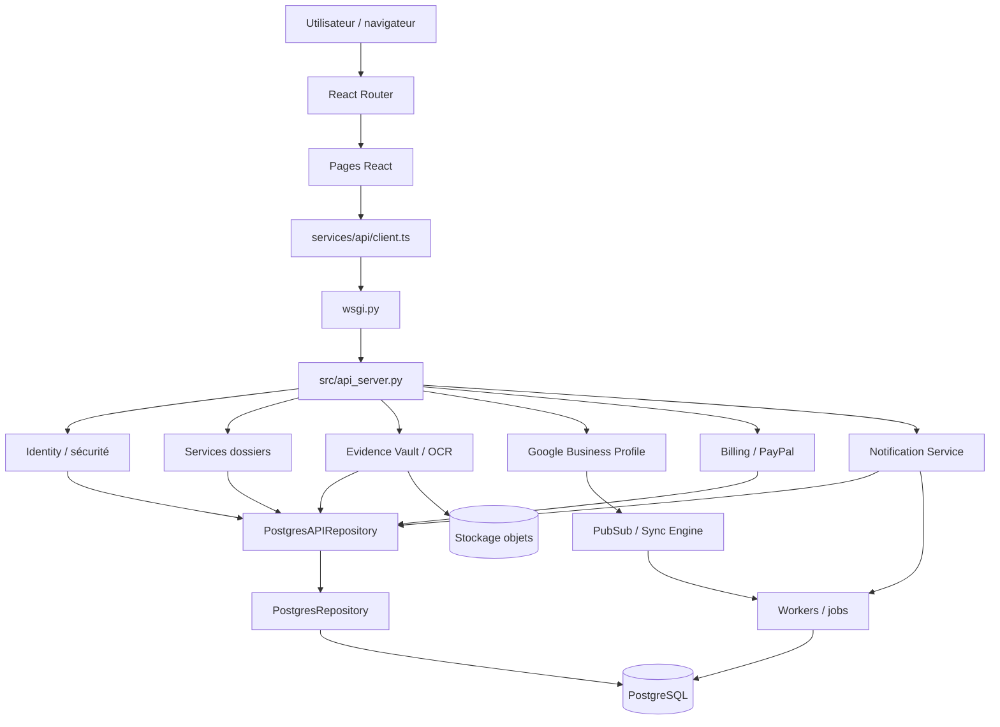

# Traçabilité des dépendances — Review Defense

> Lot J — carte statique des relations entre le frontend, le serveur HTTP, les services métier, les intégrations, les repositories et le schéma PostgreSQL. Cette documentation décrit les relations confirmées par les imports, instanciations et appels observés sur `develop`. Elle ne remplace pas un traçage dynamique et ne conclut pas qu'un fichier est mort sur la seule base d'un faible nombre d'importations.

## 1. Périmètre et méthode

Branche : `develop` — commit de référence au démarrage de l'analyse : `8112544a3a0c479d89ff8fbc0956a95ad6c30f9a`.

La cartographie repose sur :
- l'arbre Git de la branche ;
- les imports Python et TypeScript ;
- les constructions de services dans `ReviewDefenseAPI` ;
- les appels de services dans `ReviewDefenseAPI.handle()` ;
- les appels `api.get/post/patch` des pages React ;
- les noms de tables déclarés ou modifiés dans les migrations `migrations/*.sql`.

Les relations dynamiques, les chemins conditionnés par l'environnement, les appels indirects et les usages externes au dépôt peuvent ne pas apparaître dans cette carte.

## 2. Graphe global des dépendances



Le schéma représente les frontières et les familles de dépendances. Il ne signifie pas que chaque service appelle directement chaque adaptateur : les appels concrets sont détaillés dans les sections suivantes.

## 3. Frontend : pages → client API → endpoints

### Transport commun

`frontend/src/services/api/client.ts` est le point de transport :
- lit le jeton via `auth/sessionToken.ts` lorsque l'en-tête Authorization n'est pas déjà fourni ;
- centralise `fetch`, le décodage de réponse et la normalisation des erreurs ;
- expose les méthodes `api.get`, `api.post`, `api.put`, `api.patch` et `api.delete`.

`frontend/src/hooks/useApi.ts` encapsule le client dans un hook React avec état de chargement et d'erreur. Plusieurs pages appellent directement `api` sans passer par ce hook.

### Routes et consommateurs observés

| Écran / module | Endpoints utilisés (préfixes ou chemins exacts observés) | Rôle |
|---|---|---|
| `AuthContext.tsx` | `/v1/me`, `/v1/auth/login`, `/v1/auth/register`, `/v1/logout` | Session et identité courante |
| `DashboardPage.tsx` | `/v1/reviews`, `/v1/cases`, `/v1/review-queue` | Vue synthétique des avis, dossiers et éléments à traiter |
| `ReviewsPage.tsx` | `/v1/reviews` | Liste des avis |
| `ReviewDetailPage.tsx` | `/v1/reviews`, `/v1/cases` | Détail d'un avis et création/liaison d'un dossier |
| `CasesPage.tsx` | `/v1/cases` | Liste des dossiers |
| `CaseDetailPage.tsx` | `/v1/cases/{id}` et sous-actions du dossier | Détail et actions du dossier |
| `AnalysisPage.tsx` | `/v1/review-queue`, `/v1/review-queue/workload` | File de revue et charge |
| `BillingPage.tsx` | `/v1/billing`, `/v1/billing/catalog`, `/v1/paypal/config`, `/v1/paypal/subscription/config`, `/v1/paypal/subscription/confirm` | Offre, compte et confirmation PayPal |
| `NotificationsPage.tsx` | `/v1/notifications` et actions sur notification | Liste et actions de notification |
| `AdminPage.tsx` | `/v1/organization/members`, `/v1/organization/invitations`, `/v1/organization/members/{id}/role`, `/v1/auth/revoke-all` | Membres, invitations, rôles et révocation de sessions |
| `PrivacyPage.tsx` | `/v1/privacy/requests`, `/v1/privacy/export` | Demandes et export de données |
| `SettingsPage.tsx` | Aucun appel API direct repéré dans le fichier consulté | Présentation des informations du compte via AuthContext |

Le routeur `frontend/src/app/router.tsx` relie ces composants à leurs chemins `/app/*`. Le groupe est protégé par `RequireAuth` et rendu dans `AppShell`. Ce garde frontend ne remplace pas les contrôles d'accès du serveur.

## 4. Serveur HTTP : routes → services

`wsgi.py` importe `create_app` depuis `src.api_server`. `ReviewDefenseAPI` construit les services et orchestre les appels depuis `handle()`.

| Domaine HTTP | Service(s) appelé(s) | Dépendances principales |
|---|---|---|
| Authentification / identité | fonctions et repositories identité, MFA, récupération, sessions | `identity.py`, `identity_repository.py`, `security_hardening.py`, `mfa.py`, `recovery_email.py` |
| Avis | logique ReviewContext, repository, intégration Google | `review_workspace.py`, `postgres_api_repository.py`, `google_business_profile.py` |
| Dossiers `/v1/cases` | `CaseLifecycleService`, puis opérations dédiées selon l'action | `case_service.py`, `case_lifecycle_service.py`, `case_operations_service.py` |
| Analyse de contradictions | `CaseContradictionService` | `contradiction_engine.py`, `contradiction_disposition.py`, repository et audit |
| Matrice des preuves | `CaseEvidenceMatrixService` | `case_review_matrix.py`, `review_workspace.py` |
| Checklist et readiness | `CaseReviewService` | `case_review.py`, repository |
| SLA | `CaseSLAService` | `review_sla.py`, `business_calendar.py`, repository et audit |
| Escalades | `CaseEscalationService` | `escalation_workflow.py`, `CaseSLAService`, scoring de file, notifications |
| Décisions | `CaseDecisionService` | `decision_workspace.py`, signaux et faits extraits, repository |
| Approbations | `CaseApprovalService` | store / repository |
| Préparation de soumission | `CaseSubmissionService` | store / repository |
| Preuves | Evidence Vault, OCR et extraction de faits | `evidence_vault.py`, `evidence_ocr.py`, `evidence_extraction.py` |
| Notifications | `NotificationService` | outbox, policy, worker, delivery, observability |
| Facturation | catalogue / politique d'offre et client PayPal | `billing_service.py`, `billing_catalog.py`, `paypal_client.py` |
| Confidentialité | service privacy et repository | `privacy_service.py`, `postgres_repository.py` |

### Chaîne dossier

```text
POST /v1/cases
  → ReviewDefenseAPI.handle()
  → CaseLifecycleService.create()
  → CaseService / repository
  → PostgreSQL (dossier et événements)
```

Les opérations ultérieures sont réparties : checklist, SLA, affectation, escalade, contradictions, matrice, décision, gel du dossier, approbation et préparation de soumission ont des services spécialisés. La route API reste l'orchestrateur et applique le contexte utilisateur/organisation.

### Chaîne preuve

```text
POST /v1/evidence
  → validation de la requête et du contexte tenant
  → stockage du contenu via EvidenceVault / ObjectStore
  → extraction OCR si le type de fichier le nécessite
  → suggestions de faits candidats
  → vérification humaine des faits
  → repository pour métadonnées, faits et audit
```

Le stockage binaire et les métadonnées relationnelles sont deux responsabilités distinctes. Les suggestions extraites ne doivent pas être traitées comme des faits vérifiés tant qu'elles ne sont pas validées.

### Chaîne notification

```text
CaseEscalationService.queue_notification()
  → NotificationService.queue()
  → notification_outbox
  → NotificationWorker / PostgresNotificationWorker
  → notification_delivery.deliver()
  → résultat de livraison et état persistant
```

La création d'une notification, sa mise en file, la tentative d'envoi et la confirmation de livraison sont des étapes distinctes.

## 5. Dépendances des services métier

| Module | Dépend de | Appelé / utilisé par |
|---|---|---|
| `case_service.py` | modèles et hydratation depuis store/repository | cycle de vie et routes dossier |
| `case_lifecycle_service.py` | `CaseService`, horodatage, repository | routes `/v1/cases` |
| `case_review_service.py` | règles checklist/readiness, repository | actions de dossier et endpoints de revue |
| `case_sla_service.py` | calcul SLA, calendrier métier | routes dossier, file de revue, escalades |
| `case_escalation_service.py` | workflow escalade, SLA, signaux, file, notifications | routes `/v1/escalations` et calcul de suivi |
| `case_contradiction_service.py` | moteur de contradiction, disposition, hash, audit | routes d'analyse et d'arbitrage |
| `case_evidence_matrix_service.py` | matrice, extraction de claims | endpoint matrice du dossier |
| `case_decision_service.py` | espace décision, claims/signaux, audit | création, gel et approbation de décision |
| `case_submission_service.py` | store/repository | listing et préparation de soumission |
| `notification_service.py` | outbox, politique, worker, delivery, métriques | routes notifications et escalades |
| `google_pubsub_receiver.py` | parser d'événements, repository sync PostgreSQL | réception des push Pub/Sub |
| `google_sync_engine.py` | client Google Business Profile, queue, état sync | worker de synchronisation |
| `postgres_sync.py` | PostgreSQL et primitives de jobs | réception Pub/Sub et worker de sync |
| `postgres_api_repository.py` | `PostgresRepository` | `ReviewDefenseAPI` et services persistants |

## 6. Persistance : repository → tables

Les tables ci-dessous sont regroupées par leur domaine fonctionnel, d'après les migrations présentes dans `migrations/`. Certaines tables sont enrichies par plusieurs migrations successives.

| Domaine | Tables / familles |
|---|---|
| Organisation et identité | `organizations`, `users`, `memberships`, `organization_invitations`, `api_sessions`, `security_events`, `password_recovery_tokens`, `email_verification_tokens` |
| Dossiers et historique | `cases`, `case_events`, `api_cases`, `api_decisions`, `api_dossier_snapshots`, `api_approvals`, `api_submissions`, `case_review_checklist` |
| Avis et idempotence | `api_reviews`, `api_idempotency` |
| Preuves et analyse | `api_evidence`, `evidence_facts`, `evidence_fact_suggestions`, `contradiction_findings`, `contradiction_dispositions`, `contradiction_disposition_history` |
| Google / synchronisation | `google_sync_cursors`, `google_processed_events`, `google_reviews`, `google_connections`, `google_oauth_states` |
| Jobs et traitement | `background_jobs`, `processing_jobs`, `processing_job_events` |
| SLA et exploitation client | `organization_sla_calendars`, `case_escalations`, `organization_runtime_settings`, `organization_profiles`, `client_documents` |
| Notifications | `notification_outbox`, `organization_notification_policies` |
| Facturation | `billing_transactions`, `billing_accounts`, `billing_events` |
| Confidentialité | `privacy_requests`, `privacy_consents` |

### Frontières de repository

- `PostgresRepository` fournit les connexions et transactions tenant-scoped et porte plusieurs opérations de persistance transversales (privacy, dossiers, checklist, etc.).
- `PostgresAPIRepository` étend `PostgresRepository` et expose les opérations API persistantes : identité/session, avis, dossiers, décisions, snapshots, approbations, soumissions et autres agrégats.
- `PostgresSyncRepository` gère le domaine de synchronisation Google, les reçus d'événements, les curseurs et les jobs associés.
- `PostgresNotificationWorker` est un chemin spécialisé de traitement persistant des notifications.
- `EvidenceVault` et son `ObjectStore` gèrent le contenu binaire ; le repository conserve les données relationnelles et métadonnées.

Ne pas assimiler une table à un unique service : les agrégats peuvent être lus ou modifiés par plusieurs services et plusieurs migrations.

## 7. Intégrations externes et traitements asynchrones

### Google Business Profile

Le serveur API importe `src.google_business_profile` pour le flux OAuth et les opérations de lecture/synchronisation exposées par l'API. Le module contient le client HTTP, la gestion OAuth, les jetons et les ressources Google.

Le flux d'événements asynchrones est séparé :
- `AuthenticatedPubSubReceiver` authentifie le push ;
- `ReviewEventParser` normalise l'événement ;
- `PostgresSyncRepository` enregistre l'événement et planifie le travail ;
- `GoogleSyncEngine` consomme les jobs, réconcilie les pages et persiste les avis/cursors.

`src/google_integration.py` est une autre implémentation d'intégration. Elle ne doit pas être confondue avec le client `google_business_profile.py` explicitement importé par le serveur API. Son statut exact doit être décidé en retraçant ses consommateurs et ses usages de déploiement, pas à partir du nom.

### PayPal

`BillingPage` appelle les endpoints de configuration et de confirmation. Le serveur vérifie la configuration et passe par `paypal_client.py` pour les échanges fournisseur et la vérification des webhooks. `billing_service.py` décrit les offres, accès et états métier ; le navigateur ne constitue pas la source d'autorité sur l'état d'abonnement.

### Notifications

Les règles sont séparées entre policy, outbox, worker et delivery. Le worker applique les tentatives/reprises et la couche delivery exécute l'envoi email ou webhook. Le traitement persistant PostgreSQL est représenté par `PostgresNotificationWorker`.

## 8. Modules parallèles, doublons et zones à examiner

| Zone | Observation confirmée | Conséquence |
|---|---|---|
| `src/` et `backend/` | Deux ensembles de modules portant des noms de domaines similaires ; le WSGI charge `src.api_server` | Ne pas déplacer ou supprimer les modules `src/` sans retracer leurs consommateurs ; ne pas supposer que les copies backend sont actives |
| `src/google_business_profile.py` et `src/google_integration.py` | Deux implémentations Google distinctes ; le serveur API importe la première | Établir les consommateurs de la seconde avant toute consolidation |
| `src/background_jobs.py` et `src/processing_jobs.py` | Abstractions de jobs différentes ; la synchronisation Google importe la première | Ne pas fusionner sans comparer les contrats, les workers et les tables |
| `migrations/` et `database/migrations/` | Deux arbres SQL ; le script de démarrage lit `migrations/` | Identifier chaque runner et chaque pipeline avant modification |
| `frontend/src/` et ressources frontend historiques | React et pages/scripts historiques coexistent | Une page React et une page historique peuvent répondre à des chemins différents |
| `PostgresAPIRepository` et `PostgresSyncRepository` | Deux adaptateurs spécialisés | Respecter la séparation entre données métier/API et événements/cursors de synchronisation |

Aucun module n'est déclaré « mort » ou « orphelin » sur cette seule analyse. Pour établir qu'un fichier peut être supprimé, il faudrait aussi vérifier les imports indirects, les scripts d'exploitation, les jobs, les entrées dynamiques, les workflows et les usages hors dépôt.

## 9. Procédure de traçage d'une modification

Avant de toucher un fichier :
1. chercher tous les imports du module ;
2. chercher les constructions de sa classe et les appels de ses méthodes ;
3. repérer les routes HTTP qui déclenchent ces appels ;
4. identifier les pages frontend qui consomment ces routes ;
5. identifier les repositories et tables réellement touchés ;
6. vérifier les workers, événements et scripts qui partagent ces données ;
7. examiner les frontières de sécurité et de tenant ;
8. mettre à jour cette carte si la dépendance change.

## 10. Limites et niveau de certitude

- **Confirmé** : import, instanciation, appel de méthode, chemin HTTP ou déclaration SQL explicitement observé.
- **Domaine associé** : rapprochement fonctionnel cohérent entre service et migrations, sans affirmer qu'une seule classe est l'unique propriétaire de la table.
- **À examiner** : coexistence de plusieurs implémentations ou chemins historiques dont l'activité ne peut pas être conclue à partir du seul fichier.

Cette carte privilégie les relations vérifiées et les principaux flux de bout en bout. Elle n'affirme pas une matrice exhaustive fonction-par-fonction pour l'ensemble des centaines de fichiers. Aucun code applicatif n'est modifié par le lot J.
